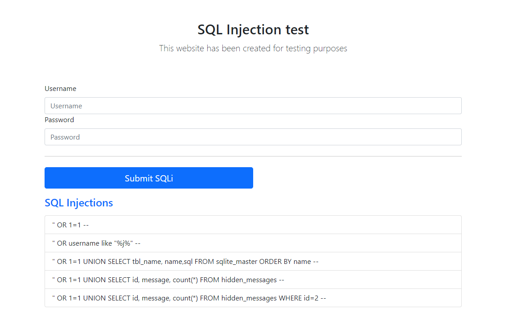
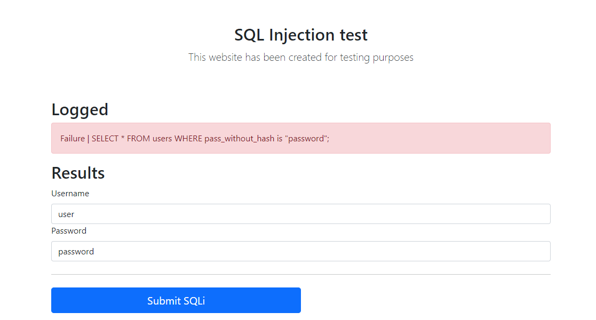
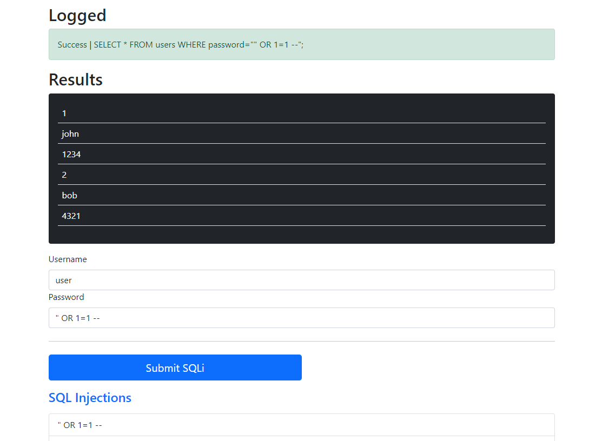

# SQL Injection flask project

## Quick start with Docker
1. Execute docker
```sh
docker-compose up
```
2. Open a browser in http://localhost:80

3. Start hacking

## DB tables

| users | id | username | pass_without_hash |
|-------|----|----------|-------------------|
|       | 1  | john     | P@ssw0rd@1234     |
|       | 2  | bob      | P@ssw0rd@4321     |

| hidden_messages | id | message           |
|-----------------|----|-------------------|
|                 | 1  | You are a h4ck3r! |
|                 | 2  | Pwned             |

## Some pictures






